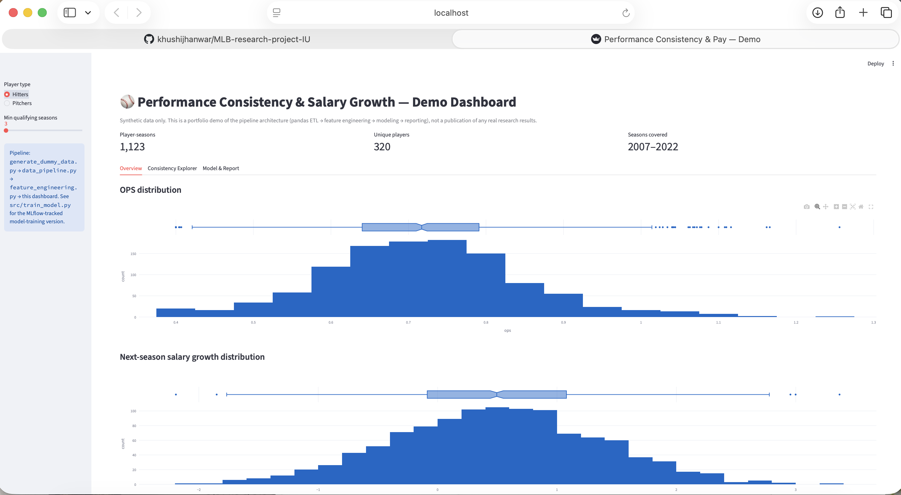
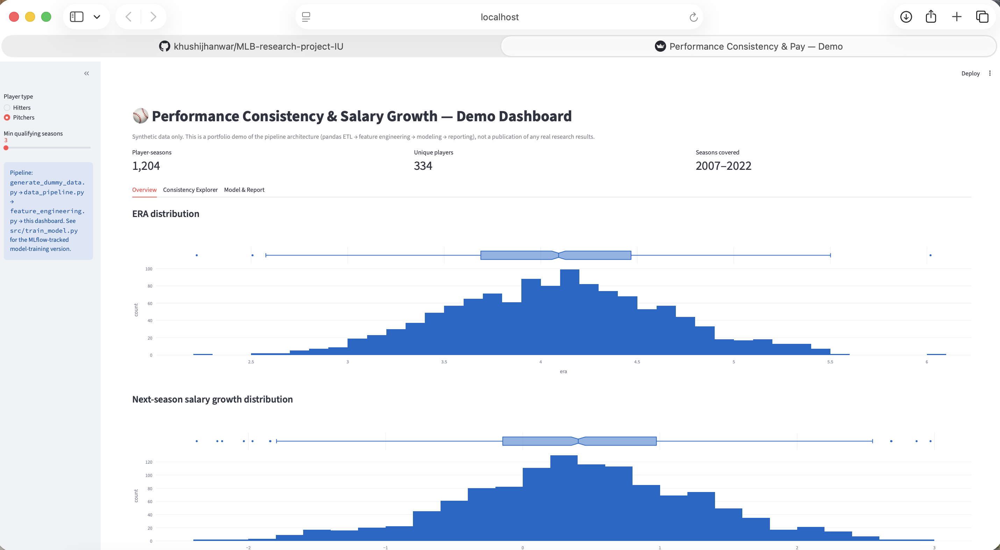
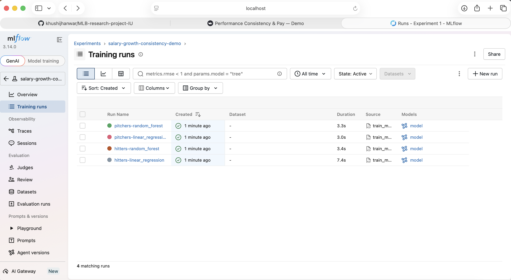
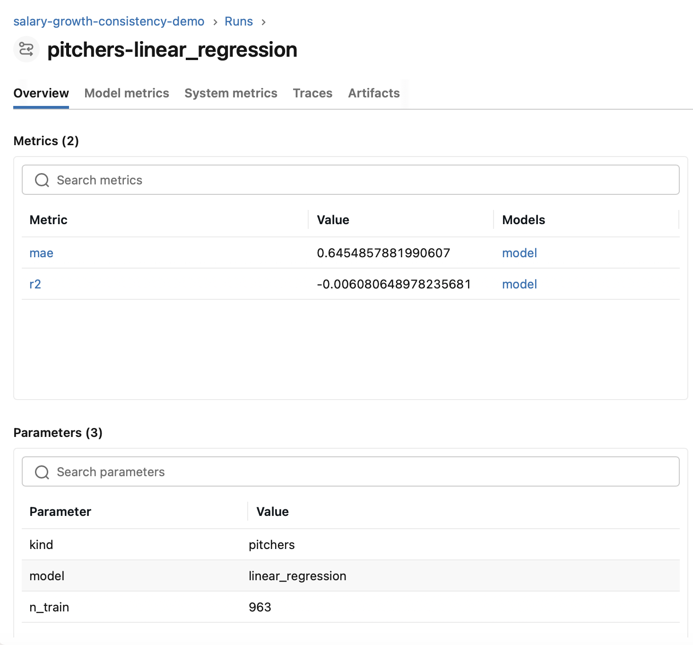
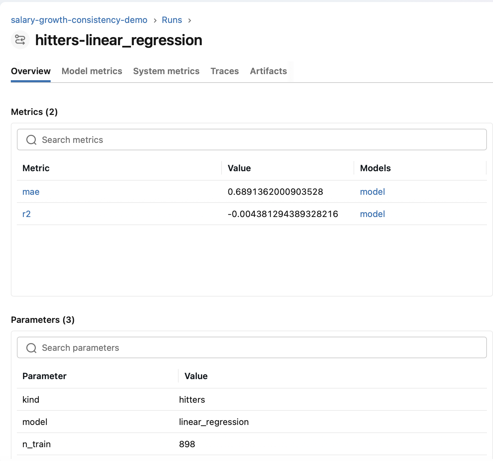
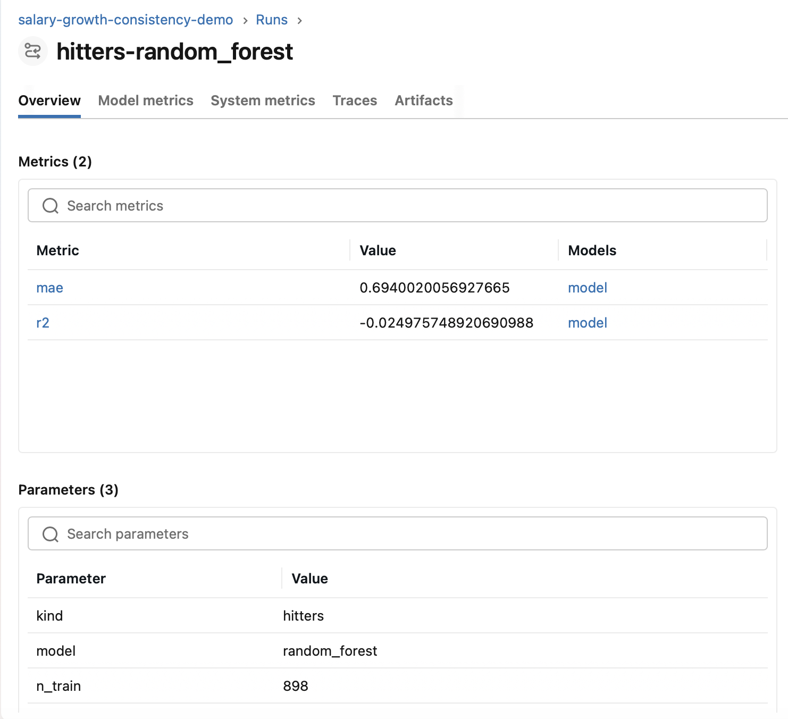

# Performance Consistency & Salary Growth — Pipeline Demo

A public, shareable demonstration of an end-to-end analytics pipeline
originally built for a real research project on player performance
consistency and compensation: synthetic data generation → pandas/SQL-style
ETL → feature engineering (scikit-learn) → experiment-tracked modeling
(MLflow) → automated reporting (Streamlit).

> **Note on this repo's data:** The underlying research — building a
> performance-consistency measure and testing it against real player salary
> data — was carried out as a real analysis on real data (the Lahman
> Baseball Database). That research is not yet published, so this public
> repo does not include the original dataset, notebook, or findings.
> Instead, this repo reproduces the **same pipeline architecture** (ETL →
> feature engineering → modeling → reporting) running on **synthetic,
> generated data** (`src/generate_dummy_data.py`), so the engineering work
> is demonstrable without disclosing unpublished results.


## Architecture

```
src/generate_dummy_data.py   → synthetic player-season CSVs
src/data_pipeline.py         → pandas ETL: aggregation, log-salary, growth targets
src/feature_engineering.py   → rolling weighted coefficient-of-variation feature
                                + sklearn StandardScaler
src/train_model.py           → sklearn models (Linear Regression, Random Forest)
                                tracked with MLflow (params, metrics, artifacts)
dashboard/app.py             → Streamlit app: interactive charts + live
                                regression + auto-generated summary + CSV export
```

## What this demonstrates

- **Scalable data pipelines** (Python, pandas): reusable `load → aggregate →
  transform` functions instead of one-off notebook cells.
- **Feature engineering workflows** (scikit-learn, MLflow): a custom rolling,
  playing-time-weighted volatility feature, standardized and fed into
  MLflow-tracked model runs for reproducible experiments.
- **Automated statistical reporting** (Streamlit): a live dashboard that
  refits a regression on filtered data and writes a plain-language summary,
  replacing a manually rebuilt report.

## Setup

```bash
python -m venv venv
source venv/bin/activate          # Windows: venv\Scripts\activate
pip install -r requirements.txt
```

## Run it

```bash
# 1. Generate synthetic data
python src/generate_dummy_data.py

# 2. (Optional) train + track models with MLflow
python src/train_model.py
mlflow ui   # view experiment runs at http://localhost:5000

# 3. Launch the dashboard
streamlit run dashboard/app.py
```

## Results (this repo's synthetic demo run)

Example output from `src/train_model.py`, tracked in MLflow (`salary-growth-consistency-demo` experiment, 4 runs) — **these numbers are from the synthetic data in this repo, not the original research**:

| Run | Model | n_train | MAE | R² |
|---|---|---|---|---|
| hitters-linear_regression | Linear Regression | 898 | 0.689 | -0.004 |
| hitters-random_forest | Random Forest | 898 | 0.694 | -0.025 |
| pitchers-linear_regression | Linear Regression | 963 | 0.645 | -0.006 |
| pitchers-random_forest | Random Forest | 963 | 0.650 | -0.016 |






R² near zero is expected here — the synthetic data generator assigns salary
mostly at random, so there's no strong relationship for the model to recover.
The point of this run is to demonstrate a working, experiment-tracked
train/evaluate loop (params, metrics, and model artifacts all logged per run),
not to demonstrate predictive performance or reproduce the real study's findings.

To reproduce and browse these runs yourself:
```bash
python src/train_model.py
mlflow ui --backend-store-uri sqlite:///mlflow.db
```

## Project structure

```
.
├── README.md
├── requirements.txt
├── data/                  # generated CSVs (gitignored)
├── src/
│   ├── generate_dummy_data.py
│   ├── data_pipeline.py
│   ├── feature_engineering.py
│   └── train_model.py
└── dashboard/
    └── app.py
```
